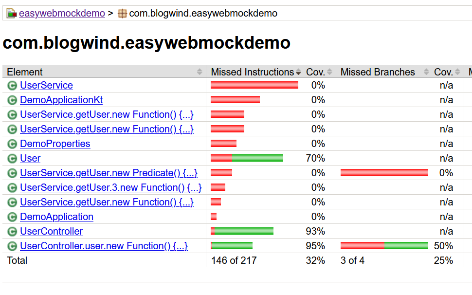
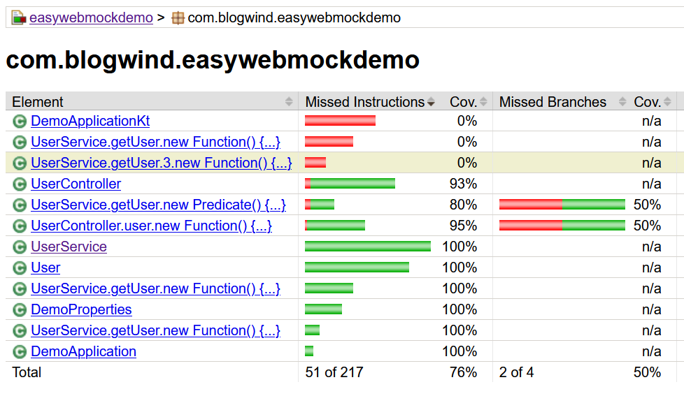

# easywebmock

[](https://travis-ci.org/Wuvist/easywebmock)

`easywebmock` is a wrapper on top of OkHttp's [mockwebserver](https://github.com/square/okhttp/tree/master/mockwebserver), to provide easy way to mock http server tesing Java projects, especially micro service projects using Spring Boot & kotlin.

# Usage

## Gradle Setup

```groovy
// Add jitpack to root build.gradle at the end of repositories
allprojects {
    repositories {
        ...
        maven { url 'https://www.jitpack.io' }
    }
}

// Add easywebmock to test dependency
dependencies {
    testImplementation 'com.github.Wuvist:easywebmock:v1.0.1'
}
```

## MockServerManager

### MockServer Usage

`MockServerManager` in `com.blogwind.easywebmock` package provides access to easywebmock's **default** mock server instance.

* `MockServerManager.newServer(name)` to create new instance of mock server other than **default** instance
* `MockServerManager.getServer(name)` to get reference of created server instance

### MockServer API

* `.setDefaultResponse(toPath: String, withResponse: MockResponse)`
  * set default [response](https://square.github.io/okhttp/4.x/mockwebserver/okhttp3.mockwebserver/-mock-response/) to path
* `.setDefaultResponse(toPath: String, withHandler: (RecordedRequest) -> MockResponse)`
  * set default handler to path
* `.setDefaultResponse(toPath: String, withString: String, contentType: String = "text/plain")`
  * set constant string response to path with contentType
* `setDefaultResponseJson(toPath: String, withObject: Any)`
  * set default object (serialized to json by [jackson-module-kotlin](https://github.com/FasterXML/jackson-module-kotlin)) to path
* `.setOneTimeResponse` & `.setOneTimeResponseJson` methods that similar to `setDefaultXXXX` methods, but will only return once, like

All `setXXXResponse` methods return current `MockServer` instance to support method chaining.

`MockServer` returns a `404` error for un-set path.

## Example

(easywebmockdemo)[https://github.com/Wuvist/easywebmockdemo] is a demo project using Spring Boot & kotlin.

It contains a simple `UserController` than make use of `UserService` to call a backend API and render page with return `User` object.

When using [mockito](https://site.mockito.org/), [testing code](https://github.com/Wuvist/easywebmockdemo/blob/master/src/test/kotlin/com/blogwind/easywebmockdemo/MockitoControllerTest.kt) will be like:
```kotlin
@Test
fun testUserController() {
    val user = User("test user", "test@abc.com", 18)
    `when`(userService.getUser(anyString())).thenReturn(Mono.just(user));

    val html = controller.user("userId").block()!!

    assertEquals(html, "<html><body><h1>test user: 18</body>")
}
```

It works, but we will need to write to additional test for `UserService`, otherwise it won't be covered:



When using `easywebmock`, [testing code](https://github.com/Wuvist/easywebmockdemo/blob/master/src/test/kotlin/com/blogwind/easywebmockdemo/WebMockControllerTest.kt), will be like:

```kotlin
@Test
fun testController() {
    val user = User("test user", "test@abc.com", 18)
    MockServerManager.setDefaultResponseJson("/user.json", user)

    val html = controller.user("userId").block()!!

    assertEquals(html, "<html><body><h1>test user: 18</body>")
}
```

It's almost identical to mockito version, except than **actual** `UserService` will be called in **spring context**, thus provide more coverage.


